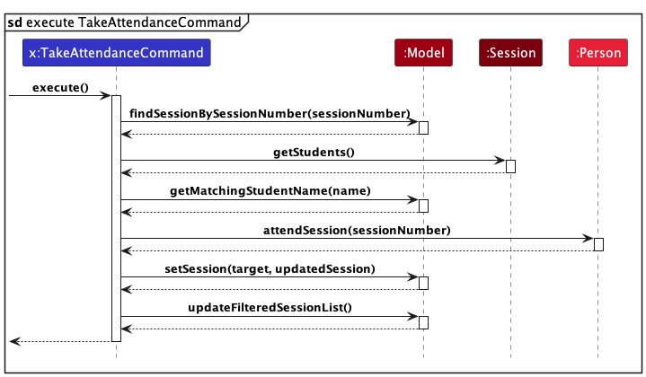

### Project: F.A.K.E.J.A.R.V.I.S.

F.A.K.E.J.A.R.V.I.S. is a project that helps CS1101S Avengers manage their time and responsibilities more effectively.

Given below are my contributions to the project:

* **New Feature**: Added the ability to create new sessions.
  * What it does: Allows Avengers to create new sessions, allowing for easy tracking of the Avenger's students' attendance and storing of other information relevant to each session.
  * Justification: This is a fundamental feature for our product because it is the most crucial aspects of the role of Avengers, which is to conduct studio tutorial sessions. This feature is the foundation for other features such as attendance taking and storing of remarks.
  * Highlights: There was some design thought given to how information is stored in the model. To prevent cyclic-reference between students and sessions, we decided to only store student models in sessions, and not sessions in students.
  * Credits: No reuse of code or third-party libraries.

* **New Feature**: Added the ability to delete created sessions.
  * What it does: Allows Avengers to delete previously created sessions, allowing for errors to be corrected when sessions are accidentally created.
  * Justification: This is an important feature enhancement for our product because given the nature of our CLI product, mistakes in inputs are likely, and the ability to delete a wrongly-created session will be important to correct these possibly frequently-occurring situations.
  * Credits: No reuse of code or third-party libraries.

* **New Feature**: Added the ability to take attendance of students for each session.
  * What it does: Enables Avengers to easily record the attendance of their students for each session, allowing for easy tracking of the Avenger's students' attendance.
  * Justification: This feature greatly complements the session feature as each session can now store information regarding students' attendance to identify studio tutorial sessions that they have attended.
  * Credits: No reuse of code or third-party libraries.

* **New Feature**: Added the ability to view the attendance of particular student(s).
  * What it does: Allows Avengers to retrieve an instant overview of their students' attendance to easily identify any studio tutorial sessions that they may have missed.
  * Justification: This feature is a significant enhancement to our product as it provides a quick and convenient way for Avengers to monitor individual students' attendance and ensure they are not missing crucial studio tutorial sessions.
  * Highlights: This enhancement needs to be able to filter the sessions based on whether the given students are present in that session. The use of Predicate<Session> allowed for easy filtering of the session by checking for the presence of given students in each session. 
  * Credits: No reuse of code or third-party libraries.

* **Code contributed**: [RepoSense](https://nus-cs2103-ay2324s1.github.io/tp-dashboard/?search=ldinghan&breakdown=true)

* **Project management**: 
  * Reviewed and approved pull requests
  * Organised and created GitHub issues

* **Enhancements to existing features**:
* Converted `address` fields to `teleHandle` fields since address is not as relevant for our product's use case and Telegram Chat is the primary form of communication.

* **Documentation**:
  * User Guide:
    * Added documentation for the Session Management Section.
    * Designed the annotated images displaying the different sections of the UI of the product.
    * Reorganised the order of sections in a more logical order.
  * Developer Guide:
    * Designed the class diagram for `Session`.
    * Designed the sequence diagram for `TakeAttendanceCommand`.
    * Designed the activity diagram for `CreateSessionCommand`.

* Some examples of UML diagrams:
  * Class diagram: 
  * Sequence diagram: 

* **Review/mentoring contributions**:
  * [ldinghan's tp comments](https://nus-cs2103-ay2324s1.github.io/dashboards/contents/tp-comments.html#47-lim-han-ldinghan-37-comments)

* **Tools**: 
  * Java
  * IntelliJ
  * Git
  * FXML
  * PlantUML

* **Contributions beyond the project team**: 
  * Contributed to module forum page to answer queries on code coverage [here](https://github.com/nus-cs2103-AY2324S1/forum/issues/267#issuecomment-1767768888)
  * Found 9 bugs during the PE-D, some of which were highly severe bugs, which helped to point out areas for improvement for another team's product.
